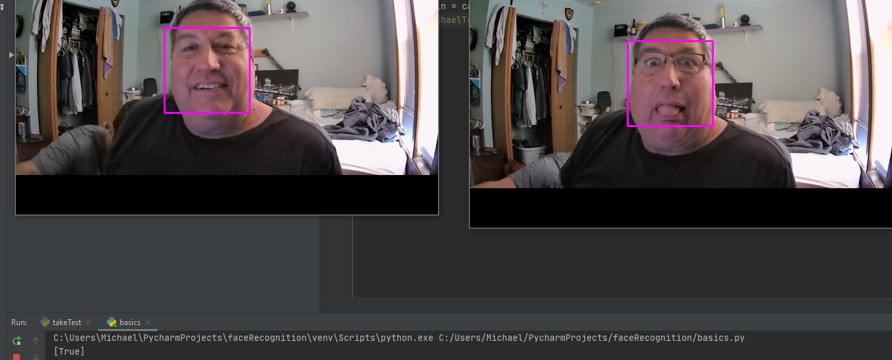

# facialRecognition
This program takes the faces from two images and compares them. returns boolean answer on if the first subject in the photo is the same person. Emphasis on first subject. Facial recognition that can handel multiple subjects at a time, coming soon.

Currently the program can be stumped by concealing parts of the face. Which was done by my ma using a hat and sunglasses.

